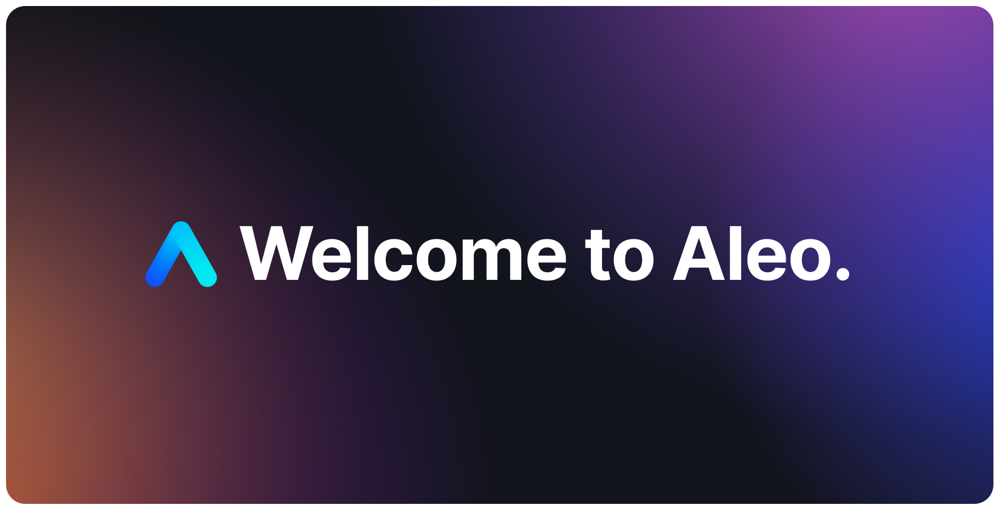

    
    
    
    
    

## 🎉 Welcome to Aleo.

This repository serves as a guide for getting started with building on Aleo. Here is a quick summary of the key components:

- [📖 Aleo Developer Docs](https://developer.aleo.org) - Developer documentation for Aleo and the Leo programming language.
- [📡 SnarkOS](http://snarkos.org/) - A decentralized operating system for private applications.
- [⚙️ SnarkVM](https://snarkvm.org/) - A virtual machine for zero-knowledge proofs.
- [🦁 Leo](https://leo-lang.org/) - A programming language for zero-knowledge proofs.
- [🛝 Leo Playground](http://play.leo-lang.org) - A browser interface to the Leo compiler for rapid ZK development and testing.
- [🧰 Aleo SDK](https://provable.tools/) - A Software Development Kit (SDK) for Zero-Knowledge Transactions.
- [🔭 Aleo Explorer](https://aleo.network) - Validate and broadcast on Aleo Testnet III

For help setting up, join us on [Discord](https://discord.com/invite/aleo) to ask questions and help others answer their questions.

We will be updating this page with FAQs to make it easy for finding common issues and to fix them quickly.

## ❤️ Contributors

Thanks goes to these wonderful people ([emoji key](https://allcontributors.org/docs/en/emoji-key)):

<!-- ALL-CONTRIBUTORS-LIST:START - Do not remove or modify this section -->
<!-- prettier-ignore-start -->
<!-- markdownlint-disable -->
<table>
  <tbody>
    <tr>
      <td align="center" valign="top" width="14.28%"><a href="https://github.com/howardwu"> <b>Howard Wu</b></a> <a href="https://github.com/AleoHQ/welcome/commits?author=howardwu" title="Code">💻</a> <a href="#ideas-howardwu" title="Ideas, Planning, & Feedback">🤔</a> <a href="#maintenance-howardwu" title="Maintenance">🚧</a> <a href="https://github.com/AleoHQ/welcome/pulls?q=is%3Apr+reviewed-by%3Ahowardwu" title="Reviewed Pull Requests">👀</a></td>
      <td align="center" valign="top" width="14.28%"><a href="https://github.com/collinc97"> <b>Collin Chin</b></a> <a href="https://github.com/AleoHQ/welcome/commits?author=collinc97" title="Code">💻</a> <a href="#maintenance-collinc97" title="Maintenance">🚧</a> <a href="#question-collinc97" title="Answering Questions">💬</a> <a href="https://github.com/AleoHQ/welcome/pulls?q=is%3Apr+reviewed-by%3Acollinc97" title="Reviewed Pull Requests">👀</a></td>
      <td align="center" valign="top" width="14.28%"><a href="https://github.com/raychu86"> <b>Raymond Chu</b></a> <a href="https://github.com/AleoHQ/welcome/issues?q=author%3Araychu86" title="Bug reports">🐛</a> <a href="https://github.com/AleoHQ/welcome/commits?author=raychu86" title="Code">💻</a> <a href="#ideas-raychu86" title="Ideas, Planning, & Feedback">🤔</a> <a href="https://github.com/AleoHQ/welcome/pulls?q=is%3Apr+reviewed-by%3Araychu86" title="Reviewed Pull Requests">👀</a></td>
      <td align="center" valign="top" width="14.28%"><a href="https://github.com/aharshbe"> <b>a h</b></a> <a href="https://github.com/AleoHQ/welcome/commits?author=aharshbe" title="Documentation">📖</a> <a href="#maintenance-aharshbe" title="Maintenance">🚧</a> <a href="#projectManagement-aharshbe" title="Project Management">📆</a> <a href="https://github.com/AleoHQ/welcome/pulls?q=is%3Apr+reviewed-by%3Aaharshbe" title="Reviewed Pull Requests">👀</a></td>
      <td align="center" valign="top" width="14.28%"><a href="https://github.com/moAlobaidi"> <b>Mohammed Alobaidi</b></a> <a href="https://github.com/AleoHQ/welcome/commits?author=moAlobaidi" title="Code">💻</a> <a href="https://github.com/AleoHQ/welcome/commits?author=moAlobaidi" title="Documentation">📖</a> <a href="#maintenance-moAlobaidi" title="Maintenance">🚧</a> <a href="https://github.com/AleoHQ/welcome/pulls?q=is%3Apr+reviewed-by%3AmoAlobaidi" title="Reviewed Pull Requests">👀</a></td>
      <td align="center" valign="top" width="14.28%"><a href="https://github.com/christianwooddell"> <b>Christian Wooddell</b></a> <a href="https://github.com/AleoHQ/welcome/commits?author=christianwooddell" title="Code">💻</a> <a href="https://github.com/AleoHQ/welcome/commits?author=christianwooddell" title="Documentation">📖</a> <a href="#maintenance-christianwooddell" title="Maintenance">🚧</a> <a href="https://github.com/AleoHQ/welcome/pulls?q=is%3Apr+reviewed-by%3Achristianwooddell" title="Reviewed Pull Requests">👀</a></td>
      <td align="center" valign="top" width="14.28%"><a href="https://alessandrocoglio.info"> <b>Alessandro Coglio</b></a> <a href="https://github.com/AleoHQ/welcome/commits?author=acoglio" title="Documentation">📖</a> <a href="#maintenance-acoglio" title="Maintenance">🚧</a> <a href="#research-acoglio" title="Research">🔬</a> <a href="https://github.com/AleoHQ/welcome/pulls?q=is%3Apr+reviewed-by%3Aacoglio" title="Reviewed Pull Requests">👀</a></td>
    </tr>
    <tr>
      <td align="center" valign="top" width="14.28%"><a href="http://www.kestrel.edu/home/people/mccarthy/"> <b>Eric McCarthy</b></a> <a href="https://github.com/AleoHQ/welcome/commits?author=bendyarm" title="Documentation">📖</a> <a href="#maintenance-bendyarm" title="Maintenance">🚧</a> <a href="#research-bendyarm" title="Research">🔬</a> <a href="https://github.com/AleoHQ/welcome/pulls?q=is%3Apr+reviewed-by%3Abendyarm" title="Reviewed Pull Requests">👀</a></td>
      <td align="center" valign="top" width="14.28%"><a href="https://github.com/mdelle1"> <b>mdelle1</b></a> <a href="https://github.com/AleoHQ/welcome/commits?author=mdelle1" title="Documentation">📖</a> <a href="#research-mdelle1" title="Research">🔬</a></td>
      <td align="center" valign="top" width="14.28%"><a href="https://victorsintnicolaas.com/"> <b>vicsn</b></a> <a href="https://github.com/AleoHQ/welcome/commits?author=vicsn" title="Documentation">📖</a> <a href="#research-vicsn" title="Research">🔬</a></td>
      <td align="center" valign="top" width="14.28%"><a href="https://move-book.com/"> <b>Damir Shamanaev</b></a> <a href="https://github.com/AleoHQ/welcome/commits?author=damirka" title="Documentation">📖</a></td>
      <td align="center" valign="top" width="14.28%"><a href="https://louiswt.github.io/"> <b>LouisWT</b></a> <a href="https://github.com/AleoHQ/welcome/commits?author=LouisWT" title="Documentation">📖</a></td>
      <td align="center" valign="top" width="14.28%"><a href="https://github.com/jules"> <b>jules</b></a> <a href="https://github.com/AleoHQ/welcome/commits?author=jules" title="Documentation">📖</a></td>
      <td align="center" valign="top" width="14.28%"><a href="https://www.linkedin.com/in/errol-drummond-354b8885/"> <b>EDGD</b></a> <a href="https://github.com/AleoHQ/welcome/commits?author=EDGDrummond" title="Documentation">📖</a></td>
    </tr>
    <tr>
      <td align="center" valign="top" width="14.28%"><a href="https://github.com/ofloxacin"> <b>ofloxacin</b></a> <a href="https://github.com/AleoHQ/welcome/commits?author=ofloxacin" title="Documentation">📖</a></td>
      <td align="center" valign="top" width="14.28%"><a href="https://github.com/SyedImam1998"> <b>Syed Imam</b></a> <a href="https://github.com/AleoHQ/welcome/commits?author=SyedImam1998" title="Documentation">📖</a></td>
      <td align="center" valign="top" width="14.28%"><a href="https://github.com/B1boid"> <b>B1boid</b></a> <a href="https://github.com/AleoHQ/welcome/commits?author=B1boid" title="Documentation">📖</a></td>
      <td align="center" valign="top" width="14.28%"><a href="https://github.com/CrypticDriver"> <b>CrypticDriver</b></a> <a href="https://github.com/AleoHQ/welcome/commits?author=CrypticDriver" title="Documentation">📖</a></td>
      <td align="center" valign="top" width="14.28%"><a href="https://github.com/rapiz1"> <b>Yujia Qiao</b></a> <a href="https://github.com/AleoHQ/welcome/commits?author=rapiz1" title="Documentation">📖</a></td>
      <td align="center" valign="top" width="14.28%"><a href="https://github.com/joshbeal"> <b>Josh Beal</b></a> <a href="https://github.com/AleoHQ/welcome/commits?author=joshbeal" title="Documentation">📖</a></td>
      <td align="center" valign="top" width="14.28%"><a href="https://github.com/unordered-set"> <b>Kostyan</b></a> <a href="https://github.com/AleoHQ/welcome/commits?author=unordered-set" title="Documentation">📖</a></td>
    </tr>
    <tr>
      <td align="center" valign="top" width="14.28%"><a href="https://detailyang.github.io/"> <b>detailyang</b></a> <a href="https://github.com/AleoHQ/welcome/commits?author=detailyang" title="Documentation">📖</a></td>
      <td align="center" valign="top" width="14.28%"><a href="https://about.me/schaeff"> <b>Thibaut Schaeffer</b></a> <a href="https://github.com/AleoHQ/welcome/commits?author=Schaeff" title="Documentation">📖</a></td>
      <td align="center" valign="top" width="14.28%"><a href="https://github.com/gluax"> <b>gluax</b></a> <a href="https://github.com/AleoHQ/welcome/commits?author=gluax" title="Documentation">📖</a></td>
      <td align="center" valign="top" width="14.28%"><a href="https://github.com/graemecode"> <b>Graeme</b></a> <a href="https://github.com/AleoHQ/welcome/commits?author=graemecode" title="Documentation">📖</a></td>
      <td align="center" valign="top" width="14.28%"><a href="https://github.com/pkrasam"> <b>pk</b></a> <a href="https://github.com/AleoHQ/welcome/commits?author=pkrasam" title="Documentation">📖</a></td>
      <td align="center" valign="top" width="14.28%"><a href="https://github.com/WietzeSlagman"> <b>Wietze</b></a> <a href="https://github.com/AleoHQ/welcome/commits?author=WietzeSlagman" title="Documentation">📖</a></td>
      <td align="center" valign="top" width="14.28%"><a href="https://github.com/features/security"> <b>Dependabot</b></a> <a href="https://github.com/AleoHQ/welcome/commits?author=dependabot" title="Code">💻</a></td>
    </tr>
    <tr>
      <td align="center" valign="top" width="14.28%"><a href="https://github.com/actions"> <b>actions-user</b></a> <a href="https://github.com/AleoHQ/welcome/commits?author=actions-user" title="Documentation">📖</a></td>
      <td align="center" valign="top" width="14.28%"><a href="https://github.com/aleosys"> <b>aleosys</b></a> <a href="https://github.com/AleoHQ/welcome/commits?author=aleosys" title="Documentation">📖</a></td>
    </tr>
  </tbody>
  <tfoot>
    <tr>
      <td align="center" size="13px" colspan="7">
        
          <a href="https://all-contributors.js.org/docs/en/bot/usage">Add your contributions</a>
        </img>
      </td>
    </tr>
  </tfoot>
</table>

<!-- markdownlint-restore -->
<!-- prettier-ignore-end -->

<!-- ALL-CONTRIBUTORS-LIST:END -->

This project follows the [all-contributors](https://github.com/all-contributors/all-contributors) specification. Contributions of any kind welcome!
