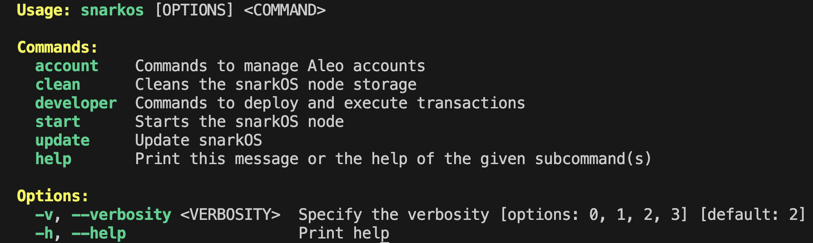
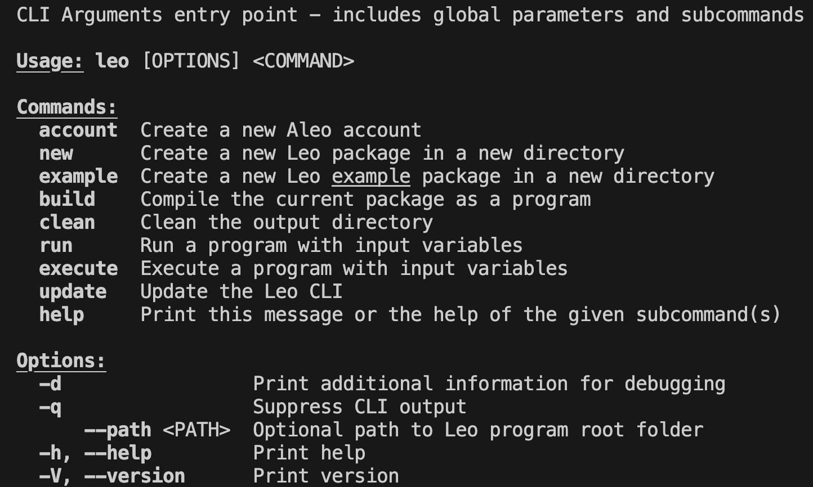
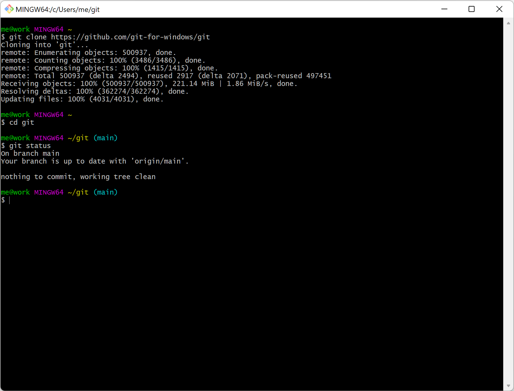
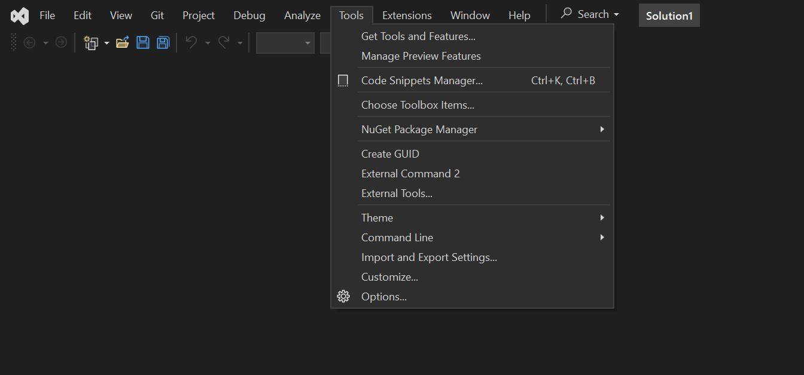
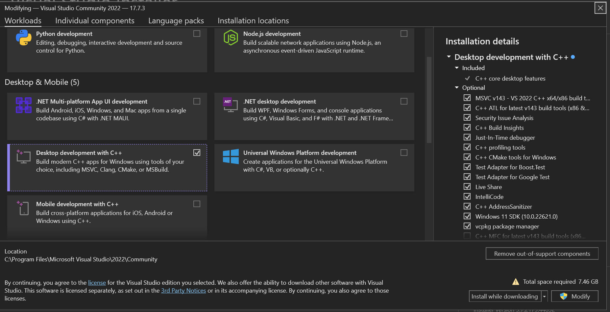
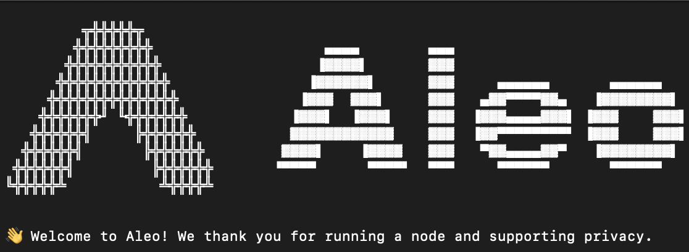
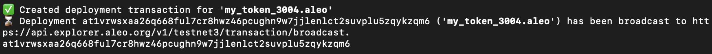
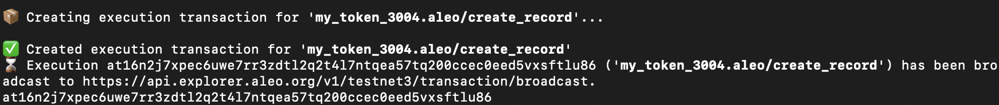

# Installation

The core Aleo software consists of 3 components: snarkOS, snarkVM, and Leo. SnarkOS is the software that hosts the programs and is used by the validators to come to consensus and generate blocks. SnarkVM is the virtual machine used to execute programs and generate circuits. Leo is the high level programming language that developers write, which first gets compiled to Aleo instructions, then to bytecode for the Aleo Virtual Machine to run.

This installation page will guide you how to install each of these 3 components.
- SnarkOS
- SnarkVM
- Leo

Depending on your system, you can get started programming with Leo in several ways:
- [Linux and MacOS](#setup-for-linux-and-macos)
- [Docker](#docker)
- Windows
    - [WSL (Recommended for windows)](#setup-for-linux-and-macos)
        - Install WSL on Windows by following this [guide](https://learn.microsoft.com/en-us/windows/wsl/install)
        - Follow the same instructions as the [Linux installation](#setup-for-linux-and-macos)
    - [Windows Installation with Git Bash](#windows-installation-with-git-bash)


After installing the core software for Leo, you might want to install these extensions for syntax highlighting for your code editor.
- [IDE Syntax Highlighting](#install-leo-ide-syntax-highlighting)
    - VSCode
    - Jetbrains
    - Sublime Text

You might want to install an Aleo wallet for a wallet user interface.
- [Aleo Wallet Installation](#aleo-wallet-installation)
    - Leo Wallet
    - Puzzle Wallet


## Setup for Linux and MacOS

### Check prerequisites
```
git --version
cargo --version
```

### Install Git and Rust

- Install [Git](https://git-scm.com/downloads)
- Install [Rust](https://www.rust-lang.org/tools/install)

Note: After installation, if your `git` and `rustc` command doesn't work, try to close the current terminal window, open a new one, and try again.

### Install snarkOS

Clone the `snarkOS` repository

```bash
git clone https://github.com/ProvableHQ/snarkOS.git --depth 1
cd snarkOS

# Switch to the mainnet branch
git checkout mainnet

[For Ubuntu users] A helper script to install dependencies is available. From the snarkOS directory, run:

```bash
./build_ubuntu.sh
```

Lastly, install snarkOS.
Note that the dot at the end of the command is required.
```
cargo install --path .
```

To test if your snarkOS is working, try typing
```bash
snarkos
```

You should see something like:


Please ensure ports 4133/tcp and 3033/tcp are open on your router and OS firewall.

For more details about how to use `snarkOS` CLI, check out [this link](https://github.com/ProvableHQ/snarkOS).

If you would like to run a local devnet, run the command

```bash
./devnet.sh
```

You would however, first need to install tmux. Instructions can be found on the github [repo](https://github.com/ProvableHQ/snarkOS)

### Install SnarkVM
- Install snarkVM from the github [repo](https://github.com/ProvableHQ/snarkvm)

```
# Download the source code
git clone https://github.com/ProvableHQ/snarkvm && cd snarkvm

# Install snarkVM
$ cargo install --path .
```

To test if snarkVM was installed successfully go to the command line and type
```bash
snarkvm
```
You should see:


### Install Leo

Clone the `leo` repository

```bash
# Download the source code
git clone https://github.com/ProvableHQ/leo
cd leo
```

Build and install `leo` CLI. Take note that the dot at the end of the command is required.

```bash
# Build and install
cargo install --path .
```

That will generate the executable ~/.cargo/bin/leo.

To test if leo was installed successfully, try typing
```bash
leo
```

You should see something like:

For more details about how to use `leo` Cli, check out [this link](https://developer.aleo.org/leo/commands)

---

## Docker

This is the development environment docker of aleo blockchain with leo, rust, and git installed.

pull docker image

```
docker pull 0xaragondocker/leo_docker:latest
```

run docker

```
docker run -it 0xaragondocker/leo_docker /bin/bash
```


## Windows Installation with Git Bash

### Rust Installation
Rust runs on many platforms, and there are many ways to install Rust. This guide describes installation via rustup, a tool that manages multiple Rust toolchains in a consistent way across all platforms Rust supports.
- On Windows, download and run [rustup-init.exe](https://static.rust-lang.org/rustup/dist/i686-pc-windows-gnu/rustup-init.exe)
- rustup-init can be configured interactively, and all options can additionally be controlled by command-line arguments, which can be passed through the shell script. Pass --help to rustup-init as follows to display the arguments rustup-init accepts:
```
    curl --proto '=https' --tlsv1.2 -sSf https://sh.rustup.rs | sh -s -- --help
```
- The above command needs to executed using WSL
- If you prefer not to use the shell script, you may directly download rustup-init for windows [here](https://static.rust-lang.org/rustup/dist/x86_64-pc-windows-msvc/rustup-init.exe)
- verify rust installation by runnin ```rustc --version``` in wsl


### Git
- Install [Git](https://git-scm.com/downloads)
- This should give you access to git bash, which we will need for installation of more software below
- Git bash can be found by searching for 'git' when you press the start button
- This is how it looks like when you open it up.



### CMake
- Install [CMake](https://cmake.org/download/) by downloading the Windows x64 Installer if you're using a 64-bit machine.

### Install Visual Studio
- Install [Visual Studio](https://visualstudio.microsoft.com/downloads/)
- Open Visual Studio
- Go to Tools -> Get Tools and Features


- In the "Workloads" tab enable "Desktop development with C++"

- Click Modify to install


### LLVM Installation
- Install [LLVM](https://github.com/llvm/llvm-project/releases/tag/llvmorg-18.1.4)
- Use the latest version [LLVM-18.1.4-win64.exe](https://github.com/llvm/llvm-project/releases/download/llvmorg-18.1.4/LLVM-18.1.4-win64.exe) version for a 64-bit Windows machine


### Install tmux for git bash
- Locate the folder of your git bash. By default it is (C:\Programs Files\Git\usr\bin)
- Download the latest tmux and libevent packages for your architecture from the [MSYS repo](https://repo.msys2.org/msys/). For me, this was
    - [tmux-3.4-1-x86_64.pkg.tar.zst](https://repo.msys2.org/msys/x86_64/tmux-3.4-1-x86_64.pkg.tar.zst)
    - [libevent-2.1.12-4-x86_64.pkg.tar.zst](https://repo.msys2.org/msys/x86_64/libevent-2.1.12-4-x86_64.pkg.tar.zst)
- Move these 2 files inside your git bash folder (C:\Programs Files\Git\usr\bin)


### Install SnarkOS
Using git bash, clone the `snarkOS` repository

```bash
git clone https://github.com/ProvableHQ/snarkOS.git --depth 1
cd snarkOS
cargo install --locked --path .
```

### Install SnarkVM
Using git bash, install snarkVM from the github [repo](https://github.com/ProvableHQ/snarkvm)

```
# Download the source code
git clone https://github.com/ProvableHQ/snarkvm && cd snarkvm

# Install snarkVM
$ cargo install --path .
```

To test if snarkVM was installed successfully go to the command line and type
```bash
snarkvm
```
You should see:


### Install Leo
This is similar to the Linux/MacOS instructions.

Clone the `leo` repository using git bash
```bash
# Download the source code
git clone https://github.com/ProvableHQ/leo
cd leo
```

Build and install `leo` CLI. Take note that the dot at the end of the command is required.

```bash
# Build and install
cargo install --path .
```

That will generate the executable ~/.cargo/bin/leo.

To test if leo was installed successfully, try typing
```bash
leo
```

You should see something like:


For more details about how to use `leo` Cli, check out [this link](https://developer.aleo.org/leo/commands)

---
## Troubleshooting Common Issues with snarkOS

- Compiling Woes: Ensure Rust v1.66+ is installed and use ./run-client.sh or ./run-prover.sh to initiate snarkOS.
- Connectivity Issues: Check if ports 4133/tcp and 3033/tcp are open. Also, ensure you’ve used the right commands to start snarkOS.
- Address Generation Issues: Execute source ~/.bashrc before the snarkos account new command. Check your spelling; the directory is /snarkOS, but the command is snarkos.

## Updating
To use the latest snarkVM, snarkOS, Leo features, pull the latest code from github, then run

```
cargo install --path .
```

---

## Install `leo` IDE Syntax Highlighting:

To improve the developer experience, Aleo has provided extensions for syntax highlighting for your popular code editors.
- [VSCode](https://code.visualstudio.com/download)
    - Install [Leo for VSCode](https://marketplace.visualstudio.com/items?itemName=aleohq.leo-extension) from VSCode marketplace.
    - The correct extension ID is aleohq.leo-extension, and the description should state "the official VSCode extension for Leo".
- [IntelliJ](https://www.jetbrains.com/idea/download/?section=mac)
    - [Extension here](https://plugins.jetbrains.com/plugin/19890-aleo-developer)
    - Click on the gear icon in the upper right > Plugins > gear icon up top > Install Plugin from Disk > Select the downloaded zip file
- [Sublime Text](https://www.sublimetext.com/download)
    - Install [LSP](https://packagecontrol.io/packages/LSP) and [LSP-leo](https://packagecontrol.io/packages/LSP-leo) from Package Control


## Aleo Wallet Installation
Using a chrome browser, install either of these chrome extensions to get an Aleo wallet. You can also request for testnet tokens from these wallets.
- [Leo Wallet](https://chromewebstore.google.com/detail/leo-wallet/nebnhfamliijlghikdgcigoebonmoibm)
- [Puzzle Wallet](https://chromewebstore.google.com/detail/puzzle-aleo-wallet/fdchdcpieegfofnofhgdombfckhbcokj)

---

# Setting up a localnet

1) Open terminal
2) Go to the folder where you cloned the snarkos repository [earlier](#install-snarkos).
3) run the command
```
./devnet.sh
```
4) If successful, you should see something like


5) Take note of the private key which shows on the screen, as it is populated with some aleo credits.

---

# Interacting with your program on testnet

## Build Your Program
First build you program by running
```
leo run {$TRANSITION_NAME} {$INPUTS}
```
Although this command is used to run a function, it also builds your program.

## Deploy

```
snarkos developer deploy {$PROGRAM_NAME} --private-key {$PRIVATE_KEY} --query "https://api.explorer.aleo.org/v1" --path ".build/" --broadcast "https://api.explorer.aleo.org/v1/testnet/transaction/broadcast" --priority-fee 0
```
If successful, it should look something like


The hash at the bottom of the image represents the transaction hash, which you can look up the transaction details on an [explorer](https://explorer.aleo.org)

## Execute
```
snarkos developer execute {$PROGRAM_NAME} {$TRANSITION_NAME} {$INPUT_ARGUMENTS} --private-key {$PRIVATE_KEY} --query "https://api.explorer.aleo.org/v1" --broadcast "https://api.explorer.aleo.org/v1/testnet/transaction/broadcast"
```
If successful, it should look something like


The hash at the bottom of the image represents the transaction hash, which you can look up the transaction details on an [explorer](https://explorer.aleo.org)
