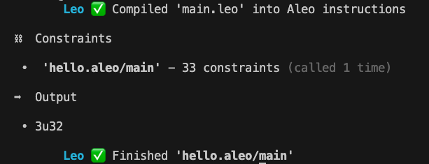
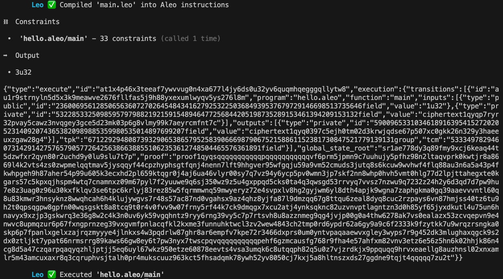

# Commands

In this section we explore the Leo CLI and explain what each command does.

Let's get started with creating a new basic project.


## leo new
```
leo new hello
cd hello
```
This creates a new folder with the following directory structure.
```
package/
├── .env # Your program environment
├── program.json # Your program manifest
├── README.md # Your program description
├── build/  # Your built program will be placed here
├── inputs/ # Will be deprecated in the future
└── src/
  └── main.leo # Your program file
```

## leo example
Creates a sample program in a new directory
Example:
```
leo example token
```
This creates the token example program in a new directory.

## leo run

```
leo run {$TRANSITION} {$INPUTS}
```
To run a Leo transition function with inputs from the command line. {$INPUTS} should be a list of inputs to the program separated by spaces. This command does not synthesize the program circuit or generate proving and verifying keys. Running this command also builds the program under the build directory.

Example:

```
leo run main 1u32 2u32
```



## leo execute

```
leo execute {$TRANSITION} {$INPUTS}
```
To execute a Leo transition function with inputs from the command line. {$INPUTS} should be a list of inputs to the program separated by spaces. This command synthesizes the program circuit and generates proving and verifying keys.

Example:

```
leo execute main 1u32 2u32
```




## leo clean
```
leo clean
```
This command cleans the build directory

## leo account
To create a new Aleo account, run:
```
leo account new

# Output:
  Private Key  APrivateKey1zkp...
     View Key  AViewKey1...
      Address  aleo1...
```

To import an existing Aleo account, run:
```
leo account import {$PRIVATE_KEY}
```

## leo update
To download and install the latest Leo version, run:
```
leo update
```
