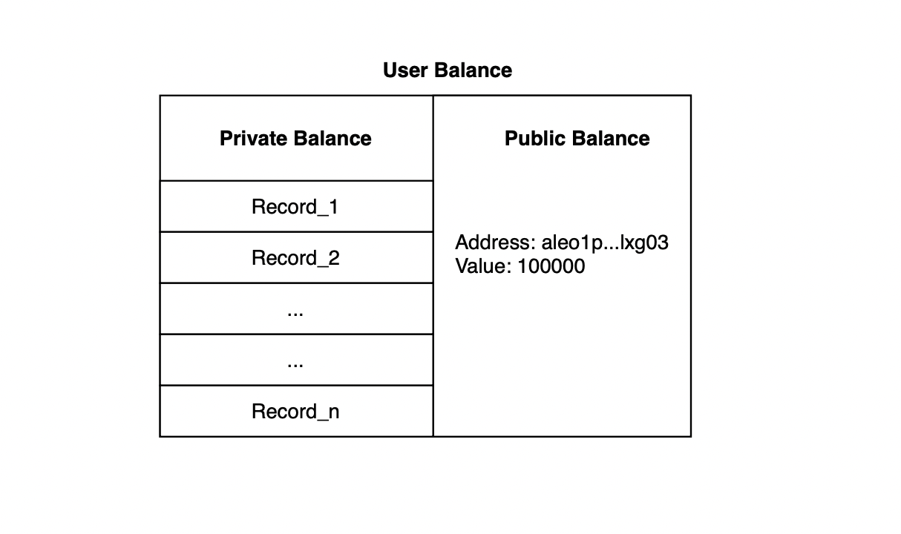

---
---

## Address Types in Aleo

In Aleo, there are two types of address: user address and program address.

User address have unique corresponding ViewKey and PrivateKey. In the Aleo network, we can create programs with privacy protection, where interactions between users and programs are invisible to everyone else. The **privacy of user addresses** is provided by the ViewKey, meaning whoever possesses the ViewKey corresponding to a user address has visibility over the records belonging to that address. The PrivateKey serves as proof of **ownership of the user address**; whoever possesses the PrivateKey corresponding to a user address owns all assets associated with that address. Address, ViewKey, and PrivateKey form a closely related set of mathematical objects designed based on cryptography. The PrivateKey can derive ViewKey, and the ViewKey can derive the Address. This process is one-way; we cannot reverse-engineer ViewKey from Address or derive PrivateKey from ViewKey.

[Learn more details about how Address、ViewKey、PrivateKey work](TODO: add link to AVM)

The program address is derived from ProgramID through a secure hash algorithm. Unlike the user address, the program address do not have corresponding ViewKeys or PrivateKeys. More accurately, while there theoretically exist ViewKey and PrivateKey uniquely determined by program address, no one can derive the corresponding ViewKey and PrivateKey from a program address. Since the program address lack PrivateKey and ViewKey, the assets associated with the program address are entirely controlled by the logic defined within the program. This is crucial for building decentralized apps (Dapps) on the Aleo network to protect the assets stored by users within Dapps.

## How to Store Assets on Aleo?



Taking Aleo Credits as an example, the user address can simultaneously possess Private Balance and Public Balance, both of which can be freely converted and used to pay Fee on the Aleo network.

Private Balance is implemented based on the Record Model (similar to Bitcoin's UTXO model but more powerful), which can be likened to physical cash. Only the owner address corresponding to a Record's ViewKey can view the specific information of the Record and whether it has been spent.

The creation of Records depends entirely on how Programs are defined.

To spend a Record, three conditions must be met:

- The Record must indeed exist and have not been spent.
- The spending of the Record must comply with the rules defined by the program (e.g., transferring Aleo Credits requires spending one Record and generating two new Records, with the sum of the amounts of the two new Records equaling the amount of the spent Record).
- Signature authorization from the Record's owner is required. Only the Record's owner can spend the Record.

[Learn more about the Record Model](TODO: Add link to record model)

Public Balance is akin to Ethereum's Account model, comparable to a bank account balance.

Public Balances are stored in a mapping format, publicly visible, with each address corresponding to one entry.


## Paying Fees on the Aleo Network

In the Aleo network, users need to use Aleo Credits to pay fees for their transactions. When users send transactions, each transaction consists of two parts: the actual payload information of the transaction, which can be either an Execution (calling a Program) or a Deployment (deploying a Program), and a Fee Transaction. The Fee Transaction is a specific type of transaction and does not exist independently. It includes a parameter, either ExecutionID or DeploymentID, ensuring that the Fee Transaction covers the fees for a specific Execution or Deployment, thus binding Execution and Fee together.

```plaintext
Transaction
- Execution || Deployment
- Fee(execution_id, fee_amount)
```
