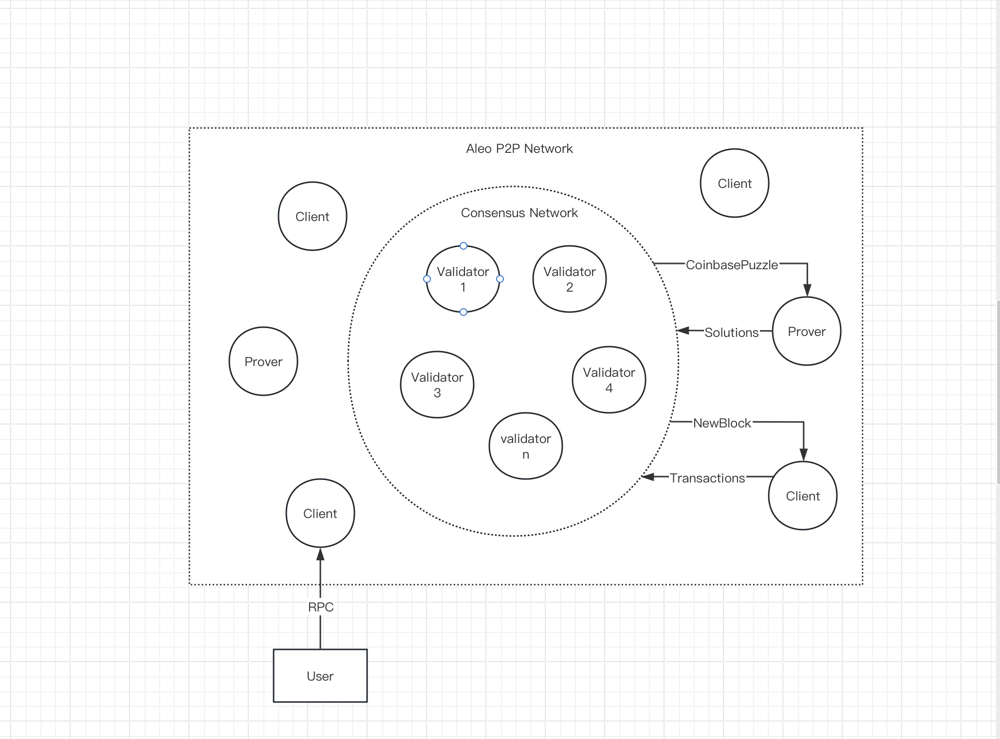

In the Aleo blockchain ecosystem, the network architecture encompasses two distinct components: the consensus network and the peer-to-peer (P2P) network. Within this framework, there exist three fundamental node types: Validators, Provers, and Clients.

### Validator

Validators are integral components of both the consensus and P2P networks. They typically operate on port 5000 for the consensus network and port 4130 for the P2P network. Validators establish connections with one another via port 5000 to establish a cohesive consensus network. It's noteworthy that Clients and Provers are **restricted** from accessing the consensus network.

The primary mandate of Validator nodes revolves around adhering to AleoBFT rules to facilitate the generation of new blocks.

Within the Aleo P2P Network, Clients and Provers engage in mutual connections through P2P mechanisms. Additionally, they establish connections with a predetermined set of Validator nodes to access the latest blocks from the consensus network.

### Client

Clients serve a pivotal role in the ecosystem by synchronizing blocks generated by the consensus network and updating ledger accordingly. Through Client's RPC, users gain access to real-time ledger state of the Aleo network and can broadcast transactions to the network. The inclusion of transactions in new blocks signifies their successful execution within the network.

### Prover

Prover nodes undertake the responsibility of synchronizing CoinbasePuzzles generated by the consensus network. They execute the requisite algorithms to derive solutions that meet specified criteria. Subsequently, Provers broadcast these solutions across the P2P network for transmission to the consensus network. Upon integration of these solutions into new blocks by the consensus network, Provers are entitled to receive corresponding CoinbaseReward incentives.
