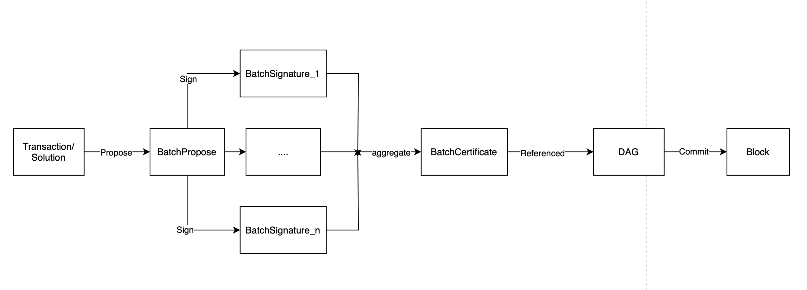
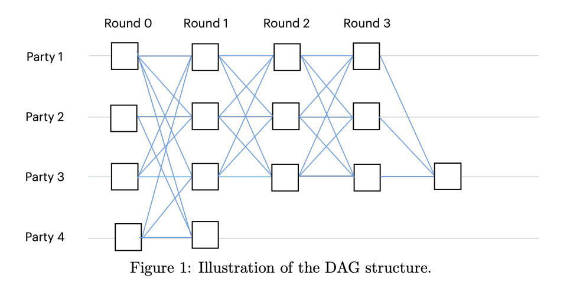

#  Validators

### Role and Function of Validator Nodes in the Network

Validator nodes in the Aleo network form a consensus network and determine block generation through the Aleo Byzantine Fault Tolerance (AleoBFT) consensus protocol. Validators acquire voting power by staking *AleoCredits*, with the node's voting power directly proportional to the amount of *AleoCredits* staked. AleoBFT ensures that when a new block is generated, it receives approval from over 2/3 of the votes, indicating consensus among honest validators. This effectively ensures network security and prevents attacks from malicious nodes. Once a block is formed, it achieves **finalized**, meaning blocks and the transactions they contain will not be reverted.

### Economic Incentives for Validator Nodes

The mechanism of AleoBFT ensures that if a malicious node attempts to attack the network, it would need to acquire at least 1/3 of the voting power to prevent the production of new blocks.. This implies that the more *AleoCredits* staked in the network, the more secure the consensus network becomes. To incentivize validator nodes to stake their *AleoCredits*, each block produced includes a corresponding *BlockReward* for validator nodes. The proportion of *BlockReward* that validator nodes receive is consistent with the proportion of *AleoCredits* they have staked.

### Become a Validator Node

To become a validator node, one needs to stake a minimum of 10,000,000 (10 million) *AleoCredits*. Once the staking transaction is accepted by the consensus network, the new validator node can immediately participate in the consensus and receive *BlockReward* incentives, thanks to the improvements made by AleoBFT over Narwhal Bullshark.

When one possesses only a small amount of *AleoCredits*, although unable to become an independent validator node, they can participate in staking through delegation.

Due to the fact that validator nodes in the network communicate with each other to obtain status information, the more validator nodes there are, the greater the magnitude of network communication required, with communication complexity being O(n). The increase in communication complexity leads to longer block generation times. In the Aleo network, the maximum number of validator nodes is limited to 200 to balance decentralization and network efficiency.

### Delegated Staking

Delegated staking allows users to stake *AleoCredits* on a specific validator node through a Program (Aleo's smart contract). The voting power gained from staking *AleoCredits* is also delegated to the respective validator node. Users receive *BlockReward* incentives in proportion to their stake, while validators may charge a certain percentage of fees set within the *Program*. Wallets and browsers such as XXX provide users with the functionality to delegate stake. Users can view fee percentages of various validators on their UI interface, facilitating the staking process.

Users can cancel their stake at any time. After cancellation, users can withdraw the *AleoCredits* refunded from the cancellation to their balance after 360 blocks.

### How validators confirm transactions/solutions

The process by which validator nodes confirm Transactions and Solutions involves the following steps:

- Transactions/Solutions enter the validator nodes' mempool via the P2P network or RPC.
- Validator nodes select some Transactions/Solutions from the mempool and include them in a BatchPropose (in addition to Transactions and Solutions, *BatchPropose* needs to contain 2f + 1 BatchCertificates from the previous round) and broadcast it to other validator nodes.
- Upon receiving *BatchPropose*, other validator nodes validate its legitimacy, sign the *BatchPropose* to generate *BatchSignature*, and return the BatchSignature to the originating validator node.
- When the originating validator node receives more than 2f + 1 *BatchSignature*s, it aggregates them into a *BatchCertificate* and broadcasts it to other validator nodes.
- All nodes execute and repeat this process, resulting in a DAG formed by the *BatchCertificate*s. When the DAG is committed, a new block is produced, and Transactions and Solutions are included in the new block.

