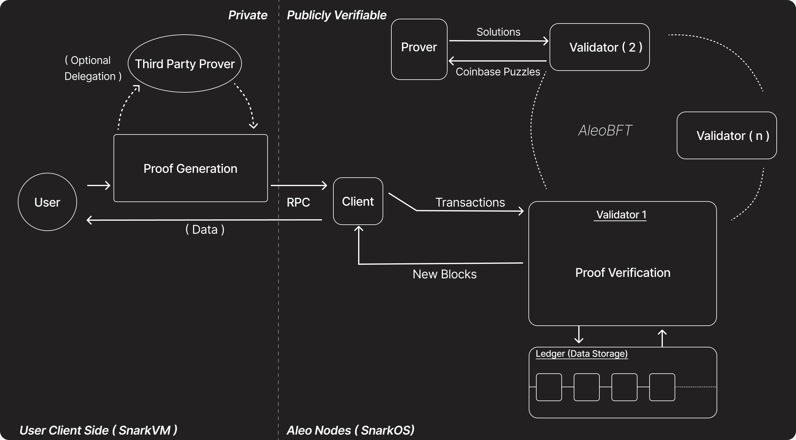

# Core Architecture

Aleo is focused on permissionless private programmability, this means the ability for anyone to codify any logic onto the Aleo blockchain wihtout asking for anyone's permission. By utilising the off chain execution environment [SnarkVM](../zkcloud/snarkvm.md) and encryption then anyone can then execute this logic in a privacy preserving manner and broadcast it to the Aleo network. For detailed information, check the [zkCloud](../zkcloud/README.md) section.

## What makes Aleo permissionless, private and programmable ?

An overview of the Aleo network architecture will help contextualize the concepts introduced in the learn section.

All these components at play in this diagram together give rise to permissionless programmable privacy.

## Components

### User
The user can request their on chain state, public or private, from an Aleo client node. They can also post any transaction they executed locally in the form of a zero knowledge proof and the inputs and outputs to the transaction.

The user can also choose to delegate their proof generation to a third party proving provider, such as some wallet providers, to gain more efficient transaction processing times.

### Third Party Prover
This is an entitiy that runs a server that allows people to delegate an authorization request to process the zero knowledge proof. This is possible because the authorization/signing is separate from the proving process.

### [More Resources on Network Participants](../network/README.md)

## User flow of executing a Private Transaction

1. User prepares inputs.

2. Fetches program from Node.

3. Executes required function from fetched program locally using snarkvm.

4. Broadcasts the output proof result along with the inputs and outputs to a client node. In the cases of private execution, the inputs and outputs are encrypted.

5. Validator verifies proof and consensus is held.

6. If transaction is verified, then it is stored in the ledger in a new block.

7. Now the transaction is fully complete.

### Further Reading
- [Storage](../concepts/storage.md)
- [Accounts](../concepts/accounts.md)
- [Leo Programs](../concepts/programs/README.md)
- [zkCloud](../zkcloud/README.md)