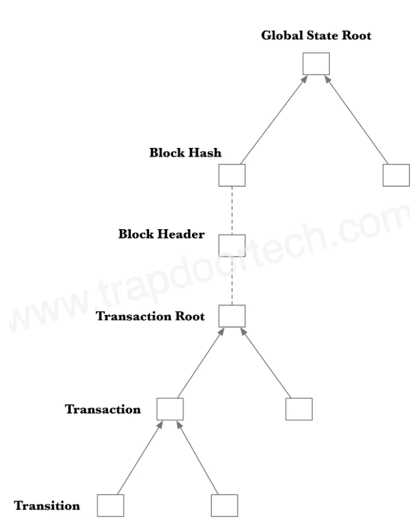
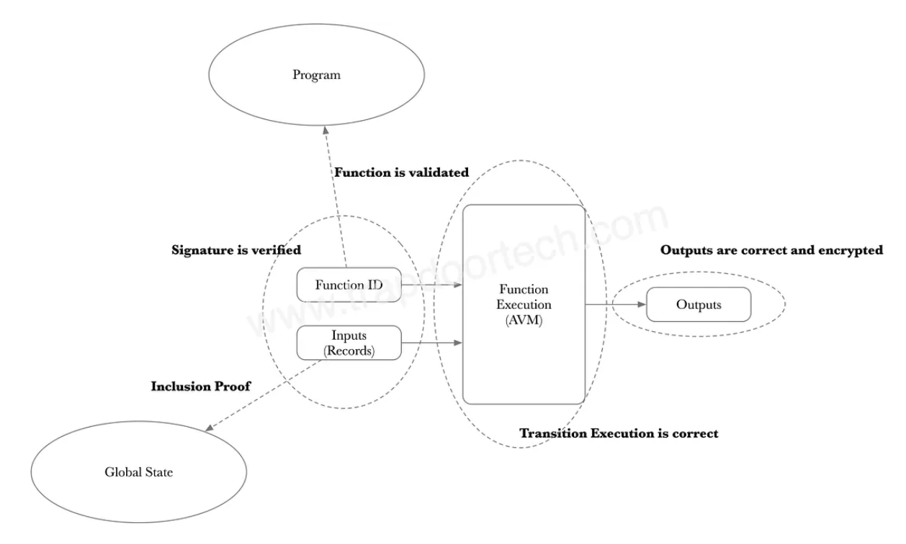

The Aleo Virtual Machine (AVM) is a computational platform integral to the Aleo blockchain, designed to run privacy-focused applications. It operates as a stack machine that executes queued instructions. Its primary function is to construct arithmetic circuits described as Rank-1 Constraint System (R1CS), from each instruction in a function.

After constructing the **R1CS**, corresponding proofs are generated using a variation of **Marlin** algorithm called **Varuna**. This approach allows for succinct verification of arbitrary computations by leveraging a **universal** and **updatable** Structured Reference String (**SRS**).

It was formalised and implemented in the Aleo Network as [ARC-0002](https://github.com/ProvableHQ/ARCs/tree/master/arc-0002).

### **Key Features of the AVM**

- **Privacy Preservation**: The AVM executes transactions and contracts while maintaining the confidentiality of the data involved. This is done using zk-SNARKs, which allow the verification of the correctness of computations without revealing the inputs or internal state.
- **Deterministic Execution**: Like other blockchain virtual machines, the AVM ensures that contract execution is deterministic, meaning it produces the same output given the same initial state and inputs across all nodes.
- **Scalability**: The use of zk-SNARKs also aids scalability. Since the computational load of verifying a zero-knowledge proof is less than repeatedly executing the computation, the AVM can handle more complex operations at a larger scale compared to traditional systems.

## **AVM’s Architecture and Design**

The AVM is virtual machine that operates on a last-in, first-out (LIFO) principle where data is stacked and the most recently added data is the first to be accessed or removed. This design is conducive to the execution of complex arithmetic circuits that are essential for the privacy-preserving features of Aleo. The AVM's architecture is designed to support the execution of private applications by leveraging zero-knowledge proofs. It uses Leo (high-level programming language), which compiles down into an intermediate representation known as AVM opcodes. These opcodes are then used to construct the R1CS, which are essential for generating zero-knowledge proofs. Check the full list [here](https://developer.aleo.org/aleo/opcodes/)

The AVM architecture can be broken down into several key components and characteristics:

### **Instruction Set Architecture (ISA)**

The Instruction Set Architecture of the AVM is custom-designed to support operations required for zero-knowledge proofs, especially zk-SNARKs. This set of instructions is optimized to handle complex mathematical operations efficiently, such as those involving elliptic curves, which are crucial for creating and verifying zero-knowledge proofs.

### **Execution Environment**

The execution environment of the AVM provides the runtime in which smart contracts are executed. This environment is tightly controlled and deterministic, meaning that given the same initial state and inputs, the execution will always produce the same output. This determinism is essential for maintaining consensus across the blockchain network.

### **Memory Management**

AVM features a structured memory model to manage both transient and persistent data:

- **Stack**: Used for temporary storage during the execution of instructions. This is typically where variables, temporary results, and stack frames (context for function calls) are stored.
- **Heap**: For dynamic allocation of memory during execution, supporting more complex data structures necessary for advanced contract functionality.
- **Storage**: This refers to the persistent state of contracts on the blockchain. Unlike stack and heap, storage data persists between transactions and is part of the blockchain's state.

### **State Transition System**

The state transition system in the AVM defines how the state of the blockchain changes in response to transactions:

- **Transactions**: These are submitted by users and can include smart contract interactions or simple transfers. They change the state of the blockchain.
- **State Transitions**: Each transaction processed by the AVM results in a state transition, updating the blockchain's global state according to predefined rules.
- **Privacy Enforcement**: During state transitions, the AVM ensures that all operations uphold the privacy guarantees promised by zero-knowledge proofs. This means sensitive data remains encrypted, and only the validity of transactions is verified.

A Merkle tree is used to represent the global state. One of the biggest challenges is to also include encrypted information in this global state.

The transaction data is not stored directly but through encrypted transitions.

Source: trapdoortech.com

### **Smart Contract Compilation and Deployment**

- **Leo Programming Language**: Smart contracts are written in Leo, a Domain Specific Language (DSL) designed for expressing the semantics of Aleo and zero-knowledge. Leo code is compiled into AVM bytecode.
- **Bytecode Execution**: The compiled bytecode is what the AVM directly executes. This bytecode is optimized for the AVM's execution environment, ensuring efficient processing and privacy preservation.

### **Networking and Consensus Layer Integration**

Although not a direct part of the AVM, the virtual machine operates within the broader context of Aleo's network architecture:

- **Block Propagation and Validation**: The AVM's execution outcomes influence block validation and propagation across the network.
- **Consensus Mechanism**: The AVM interfaces with the blockchain's consensus mechanism by providing guarantees about the correctness of executed transactions through zero-knowledge proofs, thus facilitating a secure and verifiable agreement on the state of the ledger.

### **Execution Flow**

- **Compilation**: Developers write their contracts in Leo, which compiles into AVM bytecode.
- **Deployment**: Bytecode is deployed to the Aleo network, where it is executed by the AVM.
- **Execution**: When a contract is called, the AVM processes the bytecode, leveraging zk-SNARKs to maintain privacy. The outputs verify that the contract executed correctly without revealing any sensitive information.
