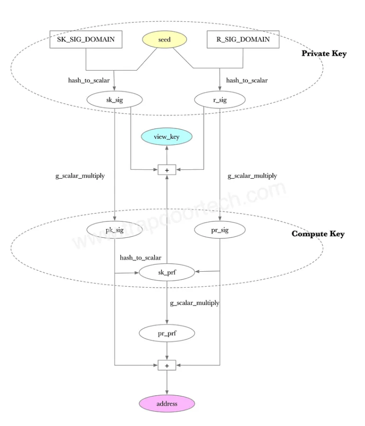

An Aleo account is similar to accounts on other blockchain platforms but designed with a focus on privacy, leveraging cryptographic techniques unique to the platform. Here's a detailed breakdown of the components of an Aleo account and the processes involved in generating addresses, public keys, and private keys:

## **Account Structure**

- **Private Key**: This is the secret key that an account holder must protect. It is used to sign transactions and prove ownership of the account. In Aleo, the private key is typically a large random number.
- **Public Key**: Derived from the private key using cryptographic algorithms, the public key is used to receive transactions. It is safe to share publicly as it does not expose the private key.
- **Address**: The address is a user-friendly representation of the public key. It is what other users will use to send Aleo to your account. The address is usually derived from the public key through a series of cryptographic hash functions and encoding techniques, ensuring it is both unique and verifiable.

## **Key Generation**

Aleo generates private and public keys using elliptic curve cryptography (ECC) through a process that involves several key components and cryptographic principles. The core of this process is based on the properties of elliptic curves and the discrete logarithm problem, which provides the security foundation for the cryptographic operations. Here's a detailed explanation of how Aleo leverages elliptic curve cryptography for generating private and public keys:

- **Private Key**: generated as a random scalar from a finite field defined by the elliptic curve. This key must remain secret and secure.
- **View Key**: derived by multiplying the private key with the base point (a predefined point on the curve). This operation in ECC is non-invertible, which means you cannot derive the private key from the view key.
- **Compute Key:** similarly to the view key, it’s derived from the private key. It can be used to delegate the execution of a transaction to a third party.
- **Address:** derived from the compute key

Source: trapdoortech.com

### **Integration with Wallets and Applications**

In practice, Aleo accounts are often managed through wallets, which automate many of the processes described above. Wallets provide user interfaces for generating keys, creating and signing transactions, and managing balances without needing deep technical knowledge of the underlying cryptographic processes.
