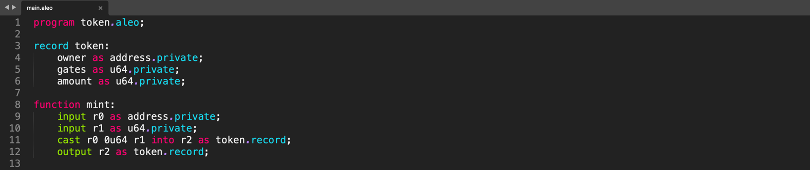
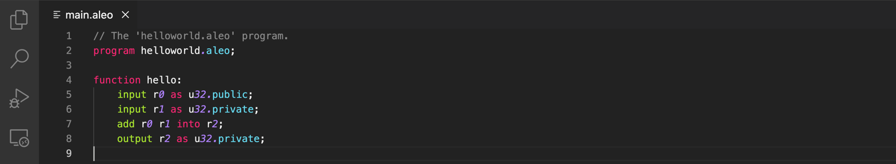
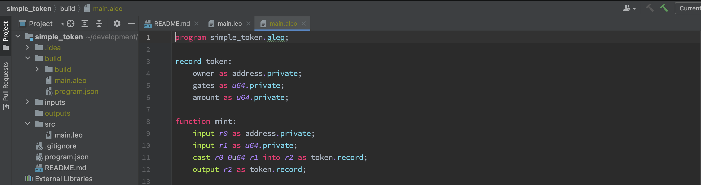

:::info
If you have installed a Leo syntax [plugin](../leo/06_tooling.md) 
then you should already be able to see syntax highlighting for `.aleo` Aleo instructions.
:::

Aleo maintains several syntax highlighting implementations across different platforms.  
If you do not see your favorite editor on this list, please reach out on [GitHub](https://github.com/AleoHQ/welcome/issues/new).

1. [Sublime Text](#sublime-text).
2. [Visual Studio Code](#vscode).
3. [Intellij](#intellij).

## Sublime Text

  
Download the editor here: https://www.sublimetext.com/download.
Aleo instructions support for Sublime's LSP plugin is provided through a language-server.

### Install

1. Install [LSP](https://packagecontrol.io/packages/LSP) and [LSP-leo](https://packagecontrol.io/packages/LSP-leo) from Package Control.
2. Restart Sublime.

### Usage

Follow these steps to toggle the `Aleo instructions` syntax highlighter.

1. Open `Sublime Text`.
2. From Preferences > Select Color Scheme... > LSP-leo

## VSCode

Download the editor here: https://code.visualstudio.com/download.

### Install

1. Install [Leo for VSCode](https://marketplace.visualstudio.com/items?itemName=aleohq.leo-extension) from VSCode marketplace.   
2. The correct extension ID is `aleohq.leo-extension`.

### Usage

1. Open `VSCode`.
2. Go to Settings > Extensions or use the left side panel Extensions button to enable the Leo plugin.

## IntelliJ

Download the editor here: https://www.jetbrains.com/idea/download/.

### Install

1. Download the [Aleo Developer Plugin](https://plugins.jetbrains.com/plugin/19890-aleo-developer) from JetBrains marketplace.
2. Click on Plugins on the left side panel > gear icon > Install Plugin from Disk > Select the downloaded zip file
