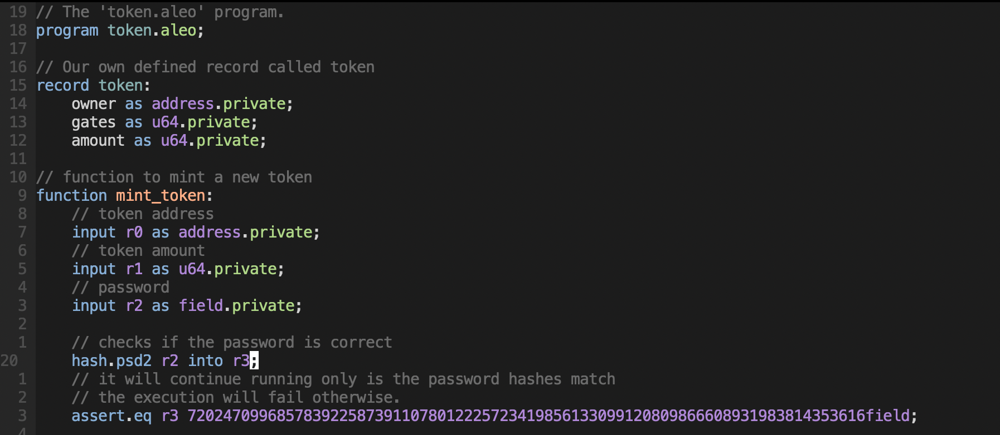

:::info
If you have installed a Leo syntax [plugin](../leo/06_tooling.md) 
then you should already be able to see syntax highlighting for `.aleo` Aleo instructions.
:::

Aleo maintains several syntax highlighting implementations across different platforms.  
If you do not see your favorite editor on this list, please reach out on [GitHub](https://github.com/AleoHQ/welcome/issues/new).

1. [Sublime Text](#sublime-text).
2. [Visual Studio Code](#vscode).
3. [Intellij](#intellij).
4. [Vim](#vim).

## Sublime Text
  
Download the editor here: https://www.sublimetext.com/download.
Aleo instructions support for Sublime's LSP plugin is provided through a language-server.
### Install

1. Install [LSP](https://packagecontrol.io/packages/LSP) and [LSP-aleo-developer](https://packagecontrol.io/packages/LSP-aleo-developer) from Package Control.
2. Restart Sublime.

### Usage

Follow these steps to toggle the `Aleo instructions` syntax highlighter.

1. Open `Sublime Text`.
2. From Preferences > Select Color Scheme... > LSP-aleo-developer

## VSCode

Download the editor here: https://code.visualstudio.com/download.

### Install

Install [Leo for VSCode](https://marketplace.visualstudio.com/items?itemName=aleohq.leo-extension) from VSCode marketplace.   
The correct extension ID is `aleohq.leo-extension`.

### Usage

1. Open `VSCode`.
2. From Preferences > Color Theme... > Aleo Theme

## Intellij


Download the editor here: https://www.jetbrains.com/idea/download/.

### Install

Install the [Aleo Developer Plugin](https://plugins.jetbrains.com/plugin/19890-aleo-developer) from JetBrains marketplace.   

## Vim


Download the editor here: https://www.vim.org/.
Or use the more up-to-date Neovim, from here: https://neovim.io/.

### Install

For activating the full functionality, this plugin requires either the plugin
manager or the `.vimrc` to have the following:

```vim
syntax enable
filetype plugin indent on
```

Most plugin managers don't do this automatically, so these statements are
usually added by users in their `vimrc` _right after_ the plugin manager load
section.

Then, just install the plugin with your favorite plugin manager.

#### [Vim8 packages][vim8pack]


```sh

git clone https://github.com/julesdesmit/aleo.vim ~/.vim/pack/plugins/start/aleo.vim

```


#### [Vundle][v]


```vim

Plugin 'julesdesmit/aleo.vim'

```


#### [Pathogen][p]


```sh

git clone --depth=1 https://github.com/julesdesmit/aleo.vim.git ~/.vim/bundle/aleo.vim

```


#### [vim-plug][vp]


```vim

Plug 'julesdesmit/aleo.vim'

```


#### [dein.vim][d]


```vim

call dein#add('julesdesmit/aleo.vim')

```


#### [NeoBundle][nb]


```vim

NeoBundle 'julesdesmit/aleo.vim'

```


[v]: https://github.com/gmarik/vundle

[p]: https://github.com/tpope/vim-pathogen

[nb]: https://github.com/Shougo/neobundle.vim

[vp]: https://github.com/junegunn/vim-plug

[d]: https://github.com/Shougo/dein.vim

[vim8pack]: http://vimhelp.appspot.com/repeat.txt.html#packages
