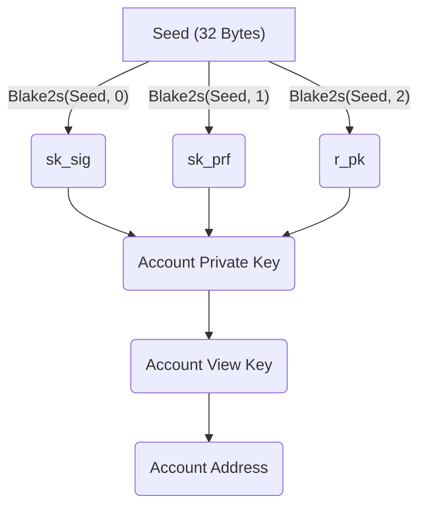

# Aleo Account 

An Aleo account is the set of keys used to sign messages, spend records, and interact with the Aleo network.

## Components

### Account Private Key

An Aleo account private key is the secret key that allows a user to spend a record.

#### Format 

The output format of an Aleo private key is a 49 character string composed of a Base58 encoded [private key prefix](#Key Prefixes) and the seed.

#### Example:
```
AKEY1b47dMA8f9GfXPsW9s16qWfiYYmWGAAcorK9RkaVpBeFA
```

### Account View Key

An Aleo account view key is derived from the Aleo private key and allows users to decrypt the [record ciphertexts](02_transactions.md#Record Ciphertexts) of the records with the corresponding Aleo address.

## Account Address

An Aleo address is the identifier used to denote a recipient/owner of new records in a transaction.

#### Format 

The output format of an Aleo address is a 63 character string composed of an [address prefix](#Key Prefixes) and a Bech32 encoded public key

#### Example:
```
aleo1y90yg3yzs4g7q25f9nn8khuu00m8ysynxmcw8aca2d0phdx8dgpq4vw348
```

## Creating Accounts

Given global instantiated Aleo [parameters and algorithms](06_parameters.md). 

### Generate a Private Key 

1. Sample a 32 byte `seed` from random
    
2. Construct private key components
    - `sk_sig` = Blake2s(`seed`, 0)
    - `sk_prf` = Blake2s(`seed`, 1)
    - `r_pk` = Blake2s(`seed`, 2)
    
3.`private_key` = (`seed`, `sk_sig`, `sk_prf`, `r_pk`)

### Generate a View Key 

1. Construct `pk_sig` = AccountSignature,GeneratePublicKey(<code>pp<sub>account_sig</sub></code>, `sk_sig`)

2. `view_key` = AccountCommitment.Commit(<code>pp<sub>account_cm</sub></code>, (`pk_sig`, `sk_prf`), `r_pk`)

### Generate an Address

1. `address` = AccountEncryption.GeneratePublicKey(<code>pp<sub>account_enc</sub></code>, `view_key`)

### Account Map



## Key Prefixes

|             |  Type  |       Prefix      |
|:-----------:|:------:|:-----------------:|
| Private Key |  bytes | [21, 38, 63, 229] |
|   Address   | string |       "aleo"      |