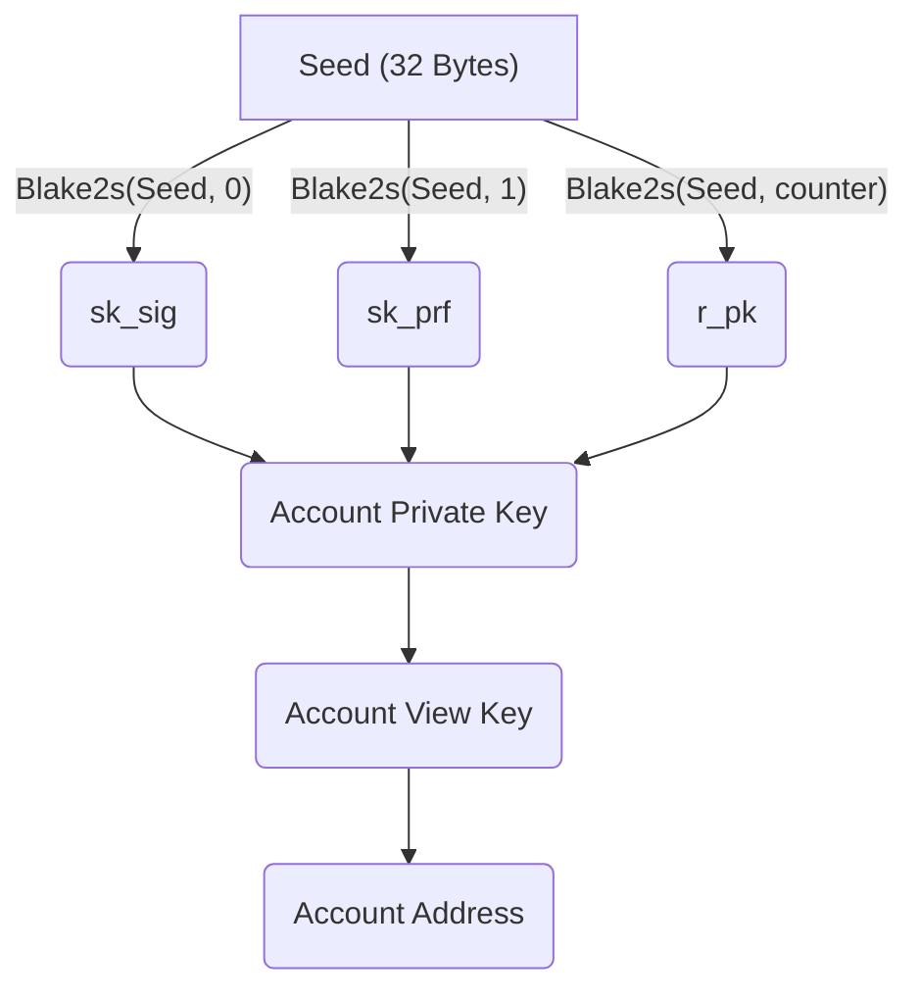

An **Aleo account** is composed of an [account private key](#account-private-key), [account view key](#account-view-key),
and an [account address](#account-address).

The account private key is used to authorize a transaction, which updates the global state of account records. The account
view key is used to decrypt account records, which are encrypted under the user's account address. Lastly, the account
address enables users to interact with one another, sending and receiving records that encode values and application data.

To protect user *assets* and *record data*, one should **never disclose their account private key** to any
third parties. For real-world applications on Aleo, users should derive an [account proving key](#account-proving-key)
from their account private key to allow third parties to *trustlessly* run applications and generate transactions
on a user's behalf.

## Account Private Key

An account private key is constructed from a randomly-sampled **account seed**. This account seed is used to generate:
- a **secret key** for the account signature scheme,
- a **pseudorandom function seed** for transaction serial numbers, and
- a **commitment randomness** for the account commitment scheme.

### Private Key Format

```
APrivateKey1b47dMA8f9GfXPsW9s16qWfiYYmWGAAcorK9RkaVpBeFA
```

An account private key is formatted as a Base58 string, comprised of 58 characters.
The account private key is encoded with a [private key prefix](#account-prefixes) that reads `APrivateKey1`, indicating
that it is a private key and should not be shared with other users.

## Account Proving Key

To facilitate user interactions at scale with ease, users can derive an account proving key which allows a prover to
trustlessly process applications and user transactions on the user's behalf.

The account proving key is comprised of:
- a **public key** for the account signature scheme,
- the **pseudorandom function seed** from the account private key, and
- the **commitment randomness** from the account private key.

While the account proving key does **not** allow the prover to arbitrarily spend assets or forge record data, it does allow the
prover to access and view account data. As such, users should provide this key only to authorized parties.

### Proving Key Format

```
AProvingKey1z3f8dMA8f9GffPsP2s85qWfiYYmBWcccorK9RkaVpAAFB
```

An account proving key is formatted as a Base58 string, comprised of 58 characters.
The account proving key is encoded with a [private key prefix](#account-prefixes) that reads `AProvingKey1`, indicating
that it is a proving key and should only be shared with authorized parties.

## Account View Key

An Aleo account view key is derived from an account private key and enables users to decrypt their
[records](03_transactions.md#record-ciphertexts) from the global ledger.
As account view keys are able to access every record in a user's account, this key can be used by
third-party auditors to verify the complete history of an account.

The account view key is comprised of:
- a **secret key** for the account encryption scheme.

### View Key Format

```
AViewKey1cVP45x3E1TxJFgiJqawy7w5WQDsUXWTbpWAXSXB1sDw8
```

An account view key is formatted as a Base58 string, comprised of 56 characters.
The account view key is encoded with a [view key prefix](#account-prefixes) that reads `AViewKey1`, indicating
that it is a private key and should only be shared with authorized parties.

## Account Address

An Aleo account address is a unique identifier that allows users to transfer value and record data to one another in transactions.

The account address is comprised of:
- a **public key** for the account encryption scheme.

### Address Format

```
aleo1y90yg3yzs4g7q25f9nn8khuu00m8ysynxmcw8aca2d0phdx8dgpq4vw348
```

An account address is formatted as a Bech32 string, comprised of 63 characters.
The account address is encoded with an [address prefix](#account-prefixes) that reads `aleo1`.

## Advanced Topics

### Account Prefixes

|                         |  Type  | Human-Readable Prefix |                    Prefix Bytes                    |
|:-----------------------:|:------:|:---------------------:|:--------------------------------------------------:|
| **Account Private Key** | bytes  | `APrivateKey1`        | `[ 127, 134, 189, 116, 210, 221, 210, 137, 144 ]`  |
| **Account Proving Key** | bytes  | `AProvingKey1`        | `[ 109, 249, 98, 224, 36, 15, 213, 187, 79, 190 ]` |
| **Account View Key**    | bytes  | `AViewKey1`           | `[ 14, 138, 223, 204, 247, 224, 122 ]`             |
| **Account Address**     | string | `aleo1`               | `aleo1`                                            |

### Offline Accounts

In many instances such as enterprise settings, it is advisable to handle sensitive keys and data on isolated, offline machines.
An Aleo account can be created on an offline machine and available for immediate use. In conjunction with account proving keys,
a user can ensure their private key remains offline even for creating transactions.

While no solution is perfect, it is advisable to create a new Aleo account on a disconnected device to minimize the risk of
leaking one's account private key to unintended parties.

### Account Commitment Outputs

The account commitment output is used to create an account view key, which is comprised of an encryption secret key. 
This encryption secret key is a scalar field element derived from the account commitment output. To ensure the validity
of the account view key, the account commitment output should be representable in the scalar field.

### Create an Account

Given global instantiated Aleo parameters and subroutines.

#### Generate a Private Key 

1. Sample a 32 byte `seed` from random
    
2. Construct private key components
    - `sk_sig` = Blake2s(`seed`, 0)
    - `sk_prf` = Blake2s(`seed`, 1)
    - `r_pk` = Blake2s(`seed`, `counter`)
           
3.`private_key` = (`seed`, `sk_sig`, `sk_prf`, `r_pk`)

`counter` is a `u16` value that is iterated on until a valid `view_key` can be derived from `private_key`

#### Generate a View Key 

1. Construct `pk_sig` = AccountSignature,GeneratePublicKey(<code>pp<sub>account_sig</sub></code>, `sk_sig`)

2. `view_key` = AccountCommitment.Commit(<code>pp<sub>account_cm</sub></code>, (`pk_sig`, `sk_prf`), `r_pk`)

#### Generate an Address

1. `address` = AccountEncryption.GeneratePublicKey(<code>pp<sub>account_enc</sub></code>, `view_key`)

### Account Diagram



