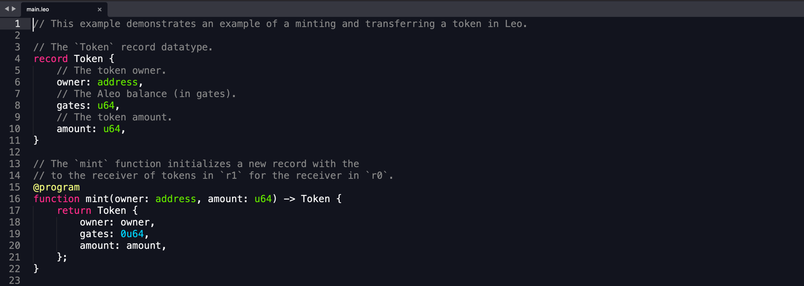
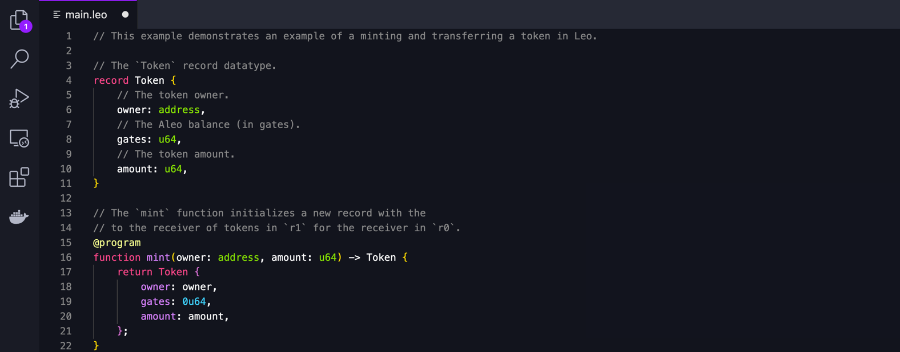

Aleo maintains several syntax highlighting implementations across different platforms.   
If you do not see your favorite editor on this list, please reach out on [github](https://github.com/AleoHQ/welcome/issues/new).

1. [Sublime Text](#sublime).
2. [Visual Studio Code](#vscode).
3. [Intellij](#intellij).

## Sublime Text
  
Download the editor here: https://www.sublimetext.com/download.

### Build

1. Download the [leo-sublime-package](https://leo-lsp-packages.sfo2.digitaloceanspaces.com/sublime-package/next/LSP-leo.sublime-package).
2. Install [package control](https://packagecontrol.io/installation).
3. Install [LSP](https://packagecontrol.io/packages/LSP).
4. Copy LSP-leo.sublime-package to `C:\Users\USER\AppData\Roaming\Sublime Text\Installed Packages`.

(On some OSes, you may need to restart `Sublime Text` for changes to take effect.)

### Usage

Follow these steps to toggle the `Leo` syntax highlighter.

1. Open `Sublime Text`.
2. Select `Sublime Text` > `Preferences` > `Select Color Scheme...` > `leo`
3. Select `View` > `Syntax` > `leo`

## VSCode

Download the editor here: https://code.visualstudio.com/download.

### Install from Marketplace (recommended)

Install the [leo language plugin](https://marketplace.visualstudio.com/items?itemName=aleohq.leo-language-features-extension) from VSCode marketplace.   
The correct extension ID is `aleohq.leo-language-features-extension`.

### Manual Install

1. Download the [leo-language-features.vsix](https://leo-lsp-packages.sfo2.digitaloceanspaces.com/vscode-extension/next/leo-language-features.vsix).
2. Run ```code --install-extension leo-language-features.vsix```.

Mirrored from the official VSCode [documentation](https://code.visualstudio.com/docs/editor/extension-marketplace#_install-from-a-vsix).

## Intellij

[//]: # (![]&#40;./images/intellij.png&#41;)
Download the editor here: https://www.jetbrains.com/idea/download/.

### Install from Marketplace

Install the [leo LSP plugin](https://plugins.jetbrains.com/plugin/19766-leo-lsp) from JetBrains marketplace.   
