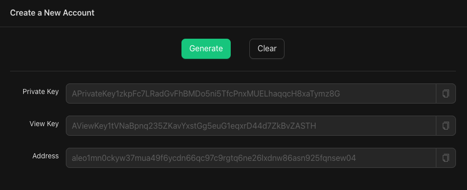

<a href="https://www.npmjs.com/package/create-aleo-app"> </a>


## 1. Installation

Please see [the installation page](00_app_installation.md) to setup the React Leo template.

## 2. Navigation

Navigate to the project you just installed. 

```bash
cd my-aleo-app
npm run dev
```

This starts a local instance of your React application at http://localhost:5173.

`src/App.jsx` contains the main body of your React application.

The `helloworld` folder is your Leo program. This is where you’ll use Leo, our statically-typed programming language built for writing private applications.

`src/workers/worker.js` is the WebAssembly (WASM) module that we'll be initializing for deployment and execution of Leo programs.

## 3. Execute `helloworld.aleo`

Navigate to http://localhost:5173 and open up the developer console.

Hit “execute helloworld.aleo”. 

Execution should happen locally and you should see an output pop up.


## 4. Deploying your Program

Let’s deploy the `helloworld` program. Deployment requires an account with Aleo credits.

### Account Generation

You can generate an account on the React application itself, or head over to [aleo.tools/account](https://aleo.tools/account) and hit “generate”. 

Write down your private key, view key, and public address in a safe place. Treat your private and view keys as keys you should never share with anyone else. 



### Faucet

Once you have your account, use our faucet to get some Aleo credits! If you haven’t joined yet, go [Discord channel](https://discord.com/invite/SMXsDEQ) and join the `#faucet` channel. You can send only one request every 20 minutes and can only request 50 credits per hour. Once you send a faucet request, Discord will start a thread under the faucet channel with your request.

Format:

```bash
/sendcredits aleo1address amt
```

Example:
```bash
/sendcredits aleo1k53lck74r93q70ftjvpkmnl5h9uwcna5wqyt80ggmz5w7lck8syskpxj46 20
```

Note down your transaction ID in the back of the URL from the faucet. The success message in the Discord thread should look like this:

```bash
Transfer successful! for message ID: 1156693507768078496
https://apiv2.aleo.network/testnet3/transaction/at12u62xwfew2rq32xee8nwhtlxghfjz7mm3528yj240nuezue625fqy4lhlp
```

### The `helloworld` Program

Since `helloworld` has already been deployed before, let’s change the name of your helloworld program by adding a suffix. You’ll want to change the code `helloworld.aleo` to `helloworld_[randomsuffix].aleo` in four files:

1. `helloworld/src/main.leo` 
2. `helloworld/src/program.json` 
3. `helloworld/build/main.leo`
4. `helloworld/build/program.json`

You won’t have to do this when actually developing a Leo program - source files compile to the build in the Leo language, but for now, let’s just change the names to move forward.

When you deploy a program, the record that you requested from the faucet is the one that will be used in order to pay for deployment. Looking in `App.jsx`, the web worker is called in order to start the deployment. Following that to `src/workers/worker.js` we see that the WASM is initalized, which allows for computation to run efficiently in the browser, and that the program manager contains methods for authoring, deploying, and interacting with Aleo programs. 

Thing is, we can hit deploy right now, but it’ll take some time to scan for transactions on the blockchain, so let’s provide the *exact* record that we’ll be pulling the fee from. This significantly quickens the deployment process, and you’ll learn about decrypting records in the process.

### Decrypting Records

When you requested credits from the faucet, you are now an owner of a private by default record with credits. Let’s find that record within the transaction.

Take your transaction ID from the Discord URL earlier:

```bash
at12u62xwfew2rq32xee8nwhtlxghfjz7mm3528yj240nuezue625fqy4lhlp
``` 

Go to “Get Transaction” at [aleo.tools/rest](https://aleo.tools/rest) and insert your transaction ID to look at the JSON object. You can similarly use https://vm.aleo.org/api/testnet3/transaction/[insert-your-transaction-id] to get the same output in your browser. 


Look at `object.execution.transitions[0].outputs[0].value` and copy the ciphertext stored there. It should look something like this:

```bash
record1qyqspk3emhy5wzu4zg59ynhwtcpwg6ez6k4cl9d690hhqcd36pqh3vcpqyxx66trwfhkxun9v35hguerqqpqzqrtc3d8s5qrlufglkk3gkvgj3w2xdul2kl0pxhvt7f85qfxm0dcpt4g5gf6u356sgte9cyzqhj940l6qsdk5uf7u2xcwfv4zrvmeqdpzjrt848
```

Navigate to [aleo.tools/record](https://aleo.tools/record) and insert the record value along with your view key that you saved earlier. You are the owner of the record, and therefore, you have the view key in order to decrypt it to show the plaintext.


Once decrypted, copy the plaintext record and paste it into line 67 of `src/workers/worker.js`. We can comment out line 64 since we don’t want the scanning function active, and instead, we want the optional manual option.

The final result in `worker.js` should look something like this:

```javascript
// // Deploy the program to the Aleo network
// const tx_id = await programManager.deploy(program, fee);

// Optional: Pass in fee record manually to avoid long scan times
const feeRecord = "{owner: aleo1qpjvun06n87jne3jwkml4jwdjqalw7n2qms03mcamenzczrj0uysp85fit.private, microcredits: 50000000u64.private, _nonce: 7736650979063383113375091219637426887776503149825722849440478642541635263210group.public}";
const tx_id = await programManager.deploy(program, fee, undefined, feeRecord);
```

Now you can hit the deploy button! 


Success, you’ve deployed an Aleo program and can how create a decentralized, private application!

## Recap & Additional Resources

1. We packaged a React template for you with Leo.

2. [Leo](https://developer.aleo.org/leo/) is our statically-typed programming language built for writing private applications.

3. We provided the Leo program `helloworld` already pre-compiled into Aleo instructions and then executed locally using WASM + web workers which was an abstraction on snarkVM’s capabilities. [snarkVM](https://developer.aleo.org/aleo/) is the data execution layer. It is used to compile Leo programs and execute them locally off-chain. All Leo programs eventually become Aleo instructions via Aleo’s compiler during the execution phase of snarkVM. 

4. Similarly, we deployed the `helloworld` program, again using the WASM + web workers abstraction layer but you can also deploy programs on-chain using [snarkOS](https://developer.aleo.org/testnet/getting_started/deploy_execute/#deploy), the data availability layer or blockchain / distributed ledger.

5. During the tutorial you navigated to [aleo.tools](https://aleo.tools), which is the graphical interface to our SDK, which serves as an abstraction layer of snarkOS and snarkVM. You’ll find you can perform similar actions (compiling, executing, deploying) on aleo.tools. 

6. The entire React template along with the WASM and web workers can also be considered an abstraction layer of snarkOS and snarkVM.