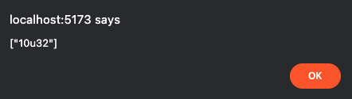
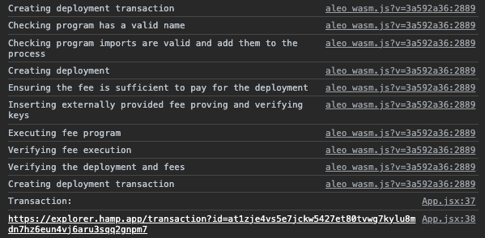
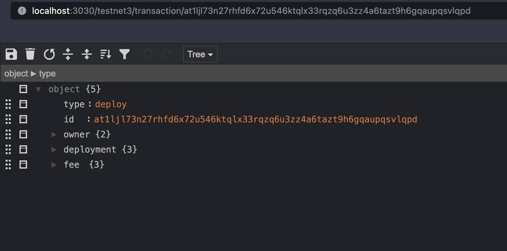

<a href="https://www.npmjs.com/package/create-aleo-app"> </a>


## 1. Installation

- Install [Aleo's transaction cannon](https://github.com/AleoHQ/tx-cannon), which will help you deploy, execute, and stress test your Leo programs.
- Install [snarkOS](https://github.com/AleoHQ/snarkOS), which will spin up a live devnet either locally or on AWS.
- Install [tmux](https://formulae.brew.sh/formula/tmux), because the devnet dashboard uses this. 
- Run these commands to set up your React App and install Leo, our statically-typed programming language built for writing private applications:
 
```bash
npm create aleo-app@latest

Project name: aleo-project-<name>
Select a framework: › React
Select a variant: › JavaScript + Leo

cd aleo-project
npm install
npm run install-leo
npm run dev
```

## 2. Navigation

<!-- markdown-link-check-disable -->
Your React application can be found at http://localhost:5173.
<!-- markdown-link-check-enable -->

`src/App.jsx` contains the main body of your React application.

`src/workers/worker.js` is the WebAssembly (WASM) module that we'll be initializing for deployment and execution of Leo programs in-browser. You can deploy and execute programs through the browser or use the handy transaction cannon you've installed as well.

The `helloworld` folder is your Leo program. This is where you’ll write and substitute your own Leo programs.

## 3. Start a local Aleo Devnet

```bash
cd snarkOS
./devnet.sh

Enter the total number of validators (default: 4): 4
Do you want to run 'cargo install --path .' to build the binary? (y/n, default: y): n
Do you want to clear the existing ledger logs? (y/n, default: n): n
```

Right when the node starts, you'll see information for node 0, copy this down! 

```bash
- 👋 Welcome to Aleo! We thank you for running a node and supporting privacy.
- 🔑 Your development private key for node 0 is <private key>
- 🪪 Your Aleo address is <address>
- 🧭 Starting a validator node on Aleo Testnet 3 Phase 3 at 0.0.0.0:4130
- 🌐 Starting the REST server at 0.0.0.0:3030
- 🔑 Your one-time JWT token is <jwt-token>
```

If you missed it because it scrolled too fast, use these `tmux` commands to scroll up:

```bash
ctrl+b+[  # enter scroll mode to scroll up
ctrl+b+w  # see all 4 validator nodes
ctrl+b+:kill-session  # kills the session
q  # exit ctrl+b mode
```

<!-- markdown-link-check-disable -->
Check that your network is running by using http://localhost:3030/testnet3/latest/height in your browser. The height should increase as a sign that your network is alive.

## 4. Execute `helloworld.aleo` locally

Navigate back to your React App at http://localhost:5173 and open up the developer console in your browser. Hit the execute `helloworld.aleo` button.
<!-- markdown-link-check-enable -->

What basically happens is the `helloworld.aleo` program (in the `helloworld`` folder) is compiled and executed using browser resources.




Remember, this is local execution. We haven't done anything with the devnet that we just spun up.

You can also execute it locally in your terminal within the root of your new Leo project. You can try it yourself and observe the outputs in the terminal.

```bash
cd aleo-project
leo run main
leo help
```

The difference between these two executions is one is using in-browser resources, while the other is utilizing local computation resources, but both are just compiling and executing the `helloworld` program in the folder

## 5. Deploying your Program on Devnet

Let’s deploy the `helloworld` program on your local devnet. 

Deployment requires an account with Aleo credits. Luckily, the devnet you spun up with the private key you jotted down is already seeded with credits. If for some reason that doesn't work, you can generate a new account and use our faucets to get a seeded account. For now, you can skip the [Account Generation](#account-generation) & [Faucet](#faucet) sections below, and go straight to [Deployment Methods](#deployment-methods).

### Account Generation

```bash
leo account new 
```

Write down your private key, view key, and public address in a safe place. Treat your private and view keys as keys you should never share with anyone else. 

### Faucet

Once you have your account, use our faucet to get some Aleo credits! We have a faucet by text and one via Discord.
<!-- markdown-link-check-disable -->
Head to our [faucet page](https://faucet.aleo.org/) and follow the instructions there. 
<!-- markdown-link-check-enable -->

After the credits have been disbursed to your address, note your transaction ID down.

You can also join our [Discord server](https://discord.gg/aleohq) and use the `#faucet` channel if texting isn't working. You can send only one request every 20 minutes and can only request 50 credits per hour. Once you send a faucet request, Discord will start a thread under the faucet channel with your request.

Format:

```bash
/sendcredits aleo1address amt
```

Example:
```bash
/sendcredits aleo1k53lck74r93q70ftjvpkmnl5h9uwcna5wqyt80ggmz5w7lck8syskpxj46 20
```

Note down your transaction ID in the back of the URL from the faucet. The success message in the Discord thread should look like this:

```bash
Transfer successful! for message ID: 1156693507768078496
https://apiv2.aleo.network/testnet3/transaction/at12u62xwfew2rq32xee8nwhtlxghfjz7mm3528yj240nuezue625fqy4lhlp
```

### Deployment Methods

<!-- markdown-link-check-disable -->
Remember you a clean devnet running at http://localhost:3030. What we want to do now is to deploy our helloworld program to that network.

Again, make sure it's running: http://localhost:3030/testnet3/latest/height
<!-- markdown-link-check-enable -->

### React App WASM Deployment

Open `App.jsx` in your `aleo-project` folder. Looking in `App.jsx`, the web worker is called in order to start the deployment. 

```js
  async function deploy() {
    setDeploying(true);
    try {
        const result = await aleoWorker.deployProgram(helloworld_program);
        console.log("Transaction:")
        console.log("https://explorer.hamp.app/transaction?id=" + result)
        alert("Transaction ID: " + result);
    } catch (e) {
        console.log(e)
        alert("Error with deployment, please check console for details");
    }
    setDeploying(false);
}
```

Following that to `src/workers/worker.js` we see that the WASM is used, which allows for efficient browser computation, and that the program manager contains methods for authoring, deploying, and interacting with Aleo programs.

```js
async function deployProgram(program) {
  const keyProvider = new AleoKeyProvider();
  keyProvider.useCache(true);

  // Create a record provider that will be used to find records and transaction data for Aleo programs
  const networkClient = new AleoNetworkClient("https://vm.aleo.org/api");

  // Use existing account with funds
  const account = new Account({
    privateKey: "user1PrivateKey",
  });

  const recordProvider = new NetworkRecordProvider(account, networkClient);

  // Initialize a program manager to talk to the Aleo network with the configured key and record providers
  const programManager = new ProgramManager(
    "https://vm.aleo.org/api",
    keyProvider,
    recordProvider,
  );
```

To deploy to the network, you'll want to change all instances of `https://vm.aleo.org/api` to `http://localhost:3030` and plug in the node private key you jotted down in place of `user1PrivateKey`.

Once you've done that, you can hit the deploy button!




Check that your deployment was successful on your network using: http://localhost:3030/testnet3/transaction/your-txn-id.



### Transaction Cannon Deployment

Using the transaction cannon to deploy programs to devnet is even easier. Create a new Leo program with a different name and use the `tx-cannon` command:

```bash
leo new helloworld-deux

tx-cannon deploy helloworld-deux/build/hellowords.aleo -k <private-key> --fee 3 -e http://localhost:3030
```

Again, you can check that your deployment was successful on your network using: http://localhost:3030/testnet3/transaction/your-txn-id.

## 6. Execution On-Chain using the Transaction Cannon 

Once your program has been deployed on devnet, it's easy to execute your program on-chain. Create a `.toml` file with these parameters:

```toml
# helloworld.aleo
[[step]]
private_keys = ["your-private-key"]
order = 0
program_id = "helloworld.aleo"
function = "main"
inputs = [ "5u32", "5u32"]
fee = 3
```

The `.toml` file basically orders transactions to be executed, through a particular Leo program and transition (function) with inputs. When we call the `tx-cannon execute` command, we ask it to look for the program we deployed on our local devnet. 

```bash
tx-cannon batch-execute --test helloworld.toml -e http://localhost:3030
```

There's much more functionality to be explored in the [`tx-cannon` repository](https://github.com/AleoHQ/tx-cannon). You can batch deploy, execute, and transfer, so take advantage of the tool to run development tests on your application!

## 7. Claim your Leo Contributor Badge!

Making it through this tutorial was no easy task, so because you've done it, we'd love to honor you with a Leo contributor badge on Github!

### Pushing your Leo Application to Github

1. Let's get to your project's directory, initialize, and commit your application.

```bash
cd aleo-project
git init -b main
git add .
git commit -m "first commit, new aleo app"
```

2. Create a new repository on your [github.com](https://github.com/new) account by hitting "new repository" in the top right. Set the repo to public, and don't worry about adding a README, license, or .gitignore files. You can add these files after your project has been pushed to GitHub. 

3. At the top of the page your new repository, click to copy the remote repository URL and go back to your terminal to link your local project to this repository.


```bash
git remote add origin <REMOTE_URL>
git remote -v
git push -u origin main
```

### Claim your Leo badge
1. Go to the Leo repo issues tab [here](https://github.com/AleoHQ/leo/issues/new/choose)
2. Go to 🥇 "Badge" and click "Get Started".
3. Follow the brief instructions and submit.
4. Once your issue is approved, we will add you to the [contributors section](https://github.com/AleoHQ/leo#%EF%B8%8F-contributors) of the Leo README.md file.

Congratulations on becoming a Leo contributor! 🎉

## 8. Recap & Additional Resources

1. You created a React template pre-packaged to use Leo programs. This sets the scaffold for creating an easy React app.

2. You also installed [Leo](https://developer.aleo.org/leo/), our statically-typed programming language built for writing private applications.

3. You executed `helloworld` using WASM, which called on in-browser resources to use [snarkVM](https://developer.aleo.org/aleo/), the data execution layer. It is used to compile Leo programs and execute them locally off-chain. All Leo programs eventually become Aleo instructions via Aleo’s compiler during the execution phase of snarkVM. 

4. You also executed `helloworld` locally in your terminal using `leo execute`, which similarly uses local computational resources to compile your Leo program using snarkVM.

5. You deployed the `helloworld` program onto a local devnet using in-browser WASM, which basically abstracted [snarkOS](https://developer.aleo.org/testnet/getting_started/deploy_execute/#deploy) functionality, which is the data availability layer or blockchain / distributed ledger. Using the transaction cannon is also an abstraction on snarkOS. 

6. Lastly, you executed the main transition on your deployed `helloworld` program using the transaction cannon, which again, abstracts the usage of snarkOS and snarkVM. You checked that `helloworld.aleo` was indeed deployed on-chain, and created an execution transaction and broadcasted it to the network. Depending on the transition itself, we can then check if the proper records or public mappings were indeed modified on-chain.

7. [aleo.tools](https://aleo.tools) is the graphical interface to our SDK, which serves as an abstraction layer of snarkOS and snarkVM. You can perform similar actions here (compiling, executing, deploying, checking on-chain state, etc).
